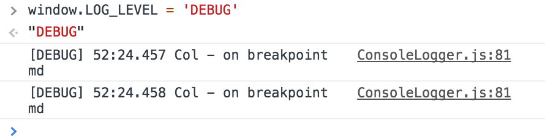

# From Station to Station

JavaScript toolkits library accumulated from working from project to project.

* [Install](#install)
* [Library](#library)
  - [Logger](#logger)
  - [Cache](#cache)
  - [Single Sign On](#single-sign-on)
  - [JS](#js)

## Install

```
npm install --save fsts
```

## Library

### Logger

Javascript developers like to write `console.log`, then cleanup, then write more, then cleanup ...

Java developers don't write a lot `System.out.println`, because they have `Logger`.

Use `Logger` in your project. Use this one, or simply write your own. No more `console.log` please.

**Usage**

```
import { Logger } from 'fsts';

const logger = new Logger('MyClass');

export default class MyClass {
    constructor() {
        logger.info('instance created');
    }

    doSomething() {
        somePromise()
            .then(data => logger.debug('some promise data', data))
            .catch(err => logger.error('some promise error', err));
    }
}
```

**Log Level**

Logger has level, by default it is 'WARN', so your `.info` and `.debug` would not write anything to conole. You can set LOG_LEVEL to see debug logs in development mode.

```
Logger.LOG_LEVEL = 'DEBUG';
```

Or during debug, write `window.LOG_LEVEL = 'DEBUG'` in your console to open it.



### Cache

Cache make use of `window.localStorage`. If not available then create in-memory cache.

```
import { Cache } from 'fsts';

const item = 'hello';
Cache.set('key', item);
Cache.get('key'); // 'hello'

const item = { greeting: 'hello' };
Cache.set('key', item);
Cache.get('key'); // { greeting: 'hello' }

const item = ['hello', 'there'];
Cache.set('key', item);
Cache.get('key'); // ['hello', 'there']
```

### Single Sign On

Library for social sign in. Encapsulate different providers implementation detail.

Each provider has these methods:

```
    provider.ready();   // returns a Promise, resolves when ready to use,
                        // rejects when error
    provider.check();   // returns a Promise, resolves an user object when success,
                        // rejects when error
    provider.signIn();  // returns a Promise, resolves an user object when success,
                        // rejects when error
    provider.signOut(); // returns a Promise, resolves when success,
                        // rejects when error
```

Google Sign In

```
import { SSO } from 'fsts';

const G = new SSO.Goolge(google_client_id);

G.ready()
    .check()
    .then(user => console.log(user))
    .catch(err => console.log(err));

G.signIn()
    .then(user => console.log(user))
    .catch(err => console.log(err));

G.signOut()
    .then(() => console.log('out'))
    .catch(err => console.log(err));
```

### JS

Javascript language helper methods

```
import { JS } from 'fsts';
```

#### String

```
JS.padNumber('9', 2); // 09
JS.padNumber('10', 2); // 10
```

#### Object

```
let obj = { a: 'a', b: 'b' };
JS.lessProps(obj, 'b'); // obj: { a: 'a' }

obj = { a: 'a', b: 'b', ba: 'ba' };
JS.lessProps(obj, 'b.*'); // obj: { a: 'a' }

obj = { a: 'a', b: 'b', c: { a: 'ca', b: 'cb' } };
JS.travaseProps(obj, (path, key, val) => {
    console.log(path, key, val);
});
```

#### Array

```
JS.isArray('str'); // false
JS.isArray({}); // false
JS.isArray([]); // true

JS.sureArray('str'); // ['str']
JS.sureArray(); // []
JS.sureArray([1, 2]); // [1, 2]

JS.appendUnique([1, 2], [1]); // [1, 2]
JS.appendUnique([1, 2], [3]); // [1, 2, 3]
```
